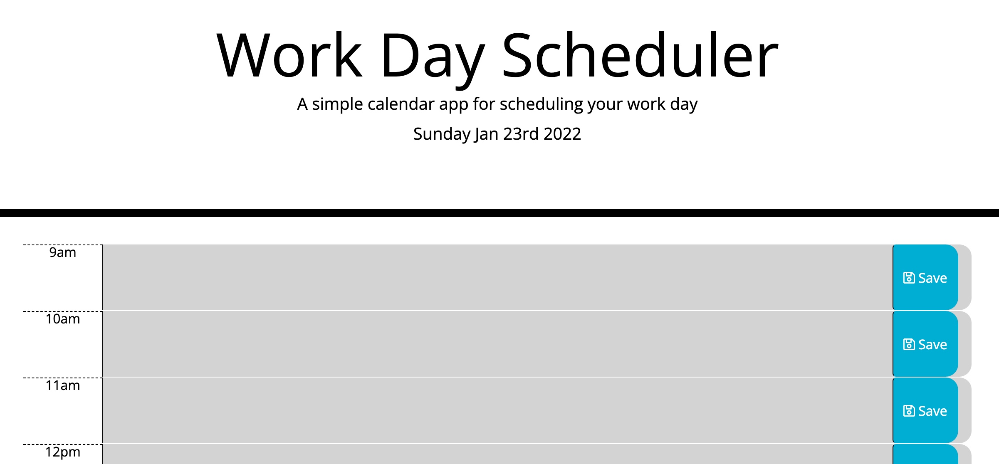

# Moments
This simple Calender app is a Week 4 Homework Task
<br><br>
## Description

The simple calender app offers a Work day scheduler in the form of a daily planner.
This allows the user to plan their day.
When the individual opens their daily planner they are presented with the current date at the top. 
They are then offered hourly timeslots in which to book meetings and activities.
<br><br>


## Functionality

the planner identifies identifies the current timeslot and differentiates this from the past and future timeslots by colour;

- Red   = Current Hour Timeslot
- Grey  = Past Hour Timeslots
- Green = Future Timeslots


```
 When the user presses the saved button their appointment is available to view when they return to the planner at a later time.

 ```

### Initial steps

- Read the Brief
- Clarify the acceptance criteria.
 <br><br>
 <p> 
 The image below shows a section of the Planner.
 </p>



<br><br>

<video src='your URL here' width=180/>
### Executing program

- Log into Github
- Create a new Repository  
- Open Terminal and navigate to where the respository will sit on the local computer.
- Copy the repository key to the local computer using 'Git clone'.
- Open the repository in VS Code using 'code .' in the terminal
- In VS Code add and edit files as per convention.
- Use 'git add .',  followed by 'git commit -m "notes"', then 'git push'

```
clone, add, commit, push, status
```
<br><br>
## Help
```
For advice on common problems or issues related to this project, please contact the author. 

```
## Authors
- Jean McLeod
- Slack @AbriCS
- Tweet [@AbriCSltd](https://twitter.com/AbriCSltd)
<br>

## Version History

- <b>0.2  The Latest<b>
    - Click [here](https://abrics.github.io/Moments/) for the final release. 2022/01/22.
- 0.1
  - Initial Release 2022/01/20
<br><br>
 
## License

This project is licensed under the [Creative Commons](https://creativecommons.org/licenses/by/2.0/uk/) Licence and is free to use and develop. Citation of the Author is recommended.
<br><br>
 
## Acknowledgments
<!--video on how to install Moments-->
https://youtu.be/n80RRNS1k64
